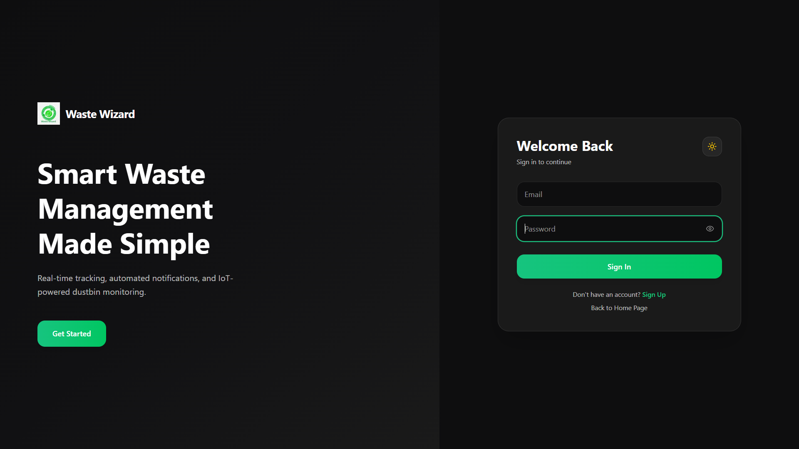
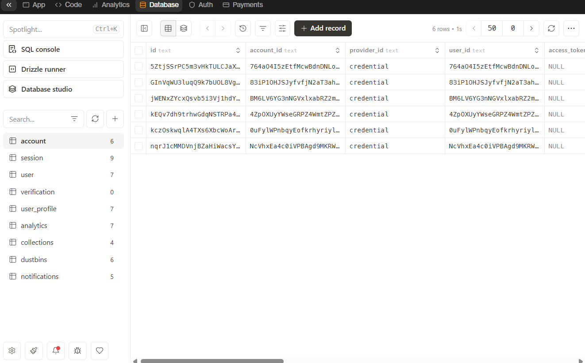

# ♻️ Waste Wizard – Smart Waste Management & Analytics System

A full-stack **IoT-ready Smart Waste Management System** designed to monitor dustbin status, prevent overflow, track locations on maps, and provide analytics for efficient waste handling.

---

## 🔗 Live Demo
👉 https://wastewizard.vercel.app/

---

## 🖼️ Project Screenshots

### 🎨 Frontend UI Overview

### 🔐 Login Page

### 📝 Registration Page

### 📊 Dashboard
.png)

### 🗺️ Map View & Tracking

### 🔔 Notification View

### 🗄️ Database Schema

---

## 🚀 Features

### User Features
- 🔐 Secure authentication (Login / Signup)
- 👤 Category-based accounts (College, Municipal, Cafe, Airport, etc.)
- 🗺️ Live dustbin location tracking using interactive maps
- 🧾 View dustbin status (Green / Red fill level)
- 🌗 Dark & Light mode support
- 📱 Fully responsive UI (mobile + desktop)

### System Features
- ➕ Add and manage dustbins
- 📊 Analytics dashboard for monitoring fill levels
- 🚨 Notification system (IoT-ready)
- ⚙️ REST APIs for future hardware integration
- 🧠 Modular backend architecture

> **Note:** Dustbin fill level defaults to **0%** until IoT hardware is connected.

---

## 🛠️ Tech Stack

### Frontend
- **Next.js 15** (App Router)
- **React 19**
- **TypeScript**
- **Tailwind CSS**
- **shadcn/ui**
- **Lucide Icons**
- **Leaflet.js** (Maps)
- **Recharts** (Analytics)

### Backend
- **Next.js API Routes**
- **REST APIs**
- **Better Auth** (Authentication)
- **Drizzle ORM**

### Database
- **Turso (LibSQL / SQLite)**  
  Serverless, lightweight, edge-ready SQL database.

### Deployment
- **Vercel**

---

## 🧠 System Architecture
---

## 🔮 Future Scope & Vision

Waste Wizard is designed as a **scalable smart-city platform**, not just a monitoring dashboard.
The long-term vision is to evolve this system into an **AI-driven, autonomous waste management ecosystem** that supports efficient, transparent, and sustainable urban operations.

---

### 🌍 Smart City Integration
- Integration with municipal and smart-city infrastructure
- City-wide waste monitoring across zones and wards
- Centralized control panel for government and municipal bodies
- Public dashboards to ensure transparency and accountability

---

### 🤖 AI & Machine Learning Enhancements
- Predictive analytics to forecast when dustbins will reach capacity
- Machine learning models trained on historical waste generation data
- Intelligent alerts generated before overflow conditions occur
- Data-driven decision support for optimized waste collection planning

---

### 🚛 Smart Route Optimization
- AI-based route planning for garbage collection vehicles
- Reduced fuel consumption and operational costs
- Faster response times for critical and high-priority locations
- Dynamic route updates based on real-time dustbin status

---

### 🔌 IoT & Automation Roadmap
- Integration of IoT sensors for real-time fill-level monitoring
- Automated data ingestion from connected hardware devices
- Rule-based automation to minimize manual intervention
- Foundation for fully autonomous waste collection workflows

---

### 🌱 Sustainability & Environmental Impact
- Prevention of waste overflow and urban pollution
- Optimized utilization of municipal resources
- Data-backed insights for long-term environmental planning
- Contribution toward cleaner, smarter, and more sustainable cities

---

